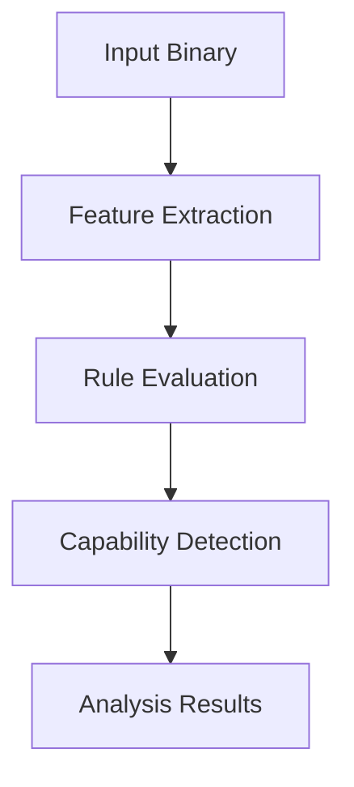

## Understanding capa’s Core Concepts & Terminology

Navigating capa’s analytical capabilities begins with a firm grasp of its foundational language. This page unveils the essential terms that form the backbone of capa’s analysis engine, empowering you to understand not just what capa does—but how it thinks and communicates its results. By mastering these concepts, you’ll be able to interpret capa’s output accurately and customize your use of the tool with confidence.

### What These Concepts Mean and Why They Matter

At its core, capa analyzes binaries to detect specific behaviors, such as network communication or file manipulation. To do this, it relies on precise, well-defined constructs like _capabilities_, _features_, and _rules_. Each serves a unique purpose, analogous to parts of a conversation between the user and the analysis engine. For instance, a "capability" represents a meaningful behavior that capa looks for, while a "rule" lays out how to recognize this behavior in code. Understanding how these interact lets you see how capa interprets complex binary patterns into actionable intelligence.

This page is essential for users—whether analysts, researchers, or developers—who want to deepen their familiarity with capa’s language. Doing so clears the path to more effective usage, whether that's reading results, writing custom rules, or integrating capa’s insights into broader workflows.

### How capa Structures Its Analysis: A High-Level Look

capa’s analysis engine operates by evaluating binaries against a hierarchy of constructs. At the top are _capabilities_—distinct behaviors capa recognizes, each detected based on a set of _rules_. These rules encode patterns to search for within the binary, broken down further into _features_—specific conditions or characteristics found in the code.

The evaluation process systematically examines the binary’s code to identify features. When these features satisfy the conditions of a rule, capa marks the corresponding capability as present. The evaluation tree built during this process captures this logical deduction and forms the basis of capa’s output.



This flow illustrates the translation from raw code to meaningful results through a layered, rule-driven method, each stage depending on the clarity of the underlying terminology.

### When Concepts Come to Life: capa in Action

Imagine you are analyzing a suspect binary to determine if it exhibits network communication behaviors. capa’s rules encode behaviors such as socket creation or HTTP request methods. These behaviors constitute _capabilities_, while the specific strings, API calls, or instruction patterns constitute _features_.

For instance, a rule may specify that if a function calls `connect()` and then sends data over a socket, capa flags the "Network Communication" capability. By understanding what a rule encompasses and how capabilities are built from features, you can precisely anticipate how capa reaches its conclusions.

This insight is invaluable when troubleshooting why capa did or didn't find a certain behavior in your binary. For instance, if a capability is not detected as expected, inspecting the corresponding rules and their feature requirements often reveals what is missing or interpreted differently.

<CodeGroup>
```yaml
rules:
  - id: network-comm
    meta:
      name: Network Communication
    features:
      - api-call: connect
      - api-call: send
```
```plaintext
Output:
- Capability: Network Communication
  Matched Rules: network-comm
```
</CodeGroup>

### Smooth Transition to Mastery: Next Steps

With a solid understanding of these core concepts and terminology, you’re equipped to move deeper into capa’s functionality. To see these constructs in motion, visit the [Feature Overview](/overview/core-concepts-and-features/feature-overview) page, where capa’s key capabilities are presented with practical examples.

If you aim to customize capa or tailor its detection to your specific needs, the [Integration & Extensibility](/overview/core-concepts-and-features/integrations-and-extensibility) section will extend your foundation.

Start putting these ideas into practice by running capa on your binaries following the guidance in [Analyzing Binaries with capa: End-to-End Workflow](/guides/getting-started-workflows/analyzing-binaries-with-capa).

<Source url="https://github.com/mandiant/capa" branch="main" paths={[{"path": "capa/rules/*.yml", "range": "1-50"}]} />