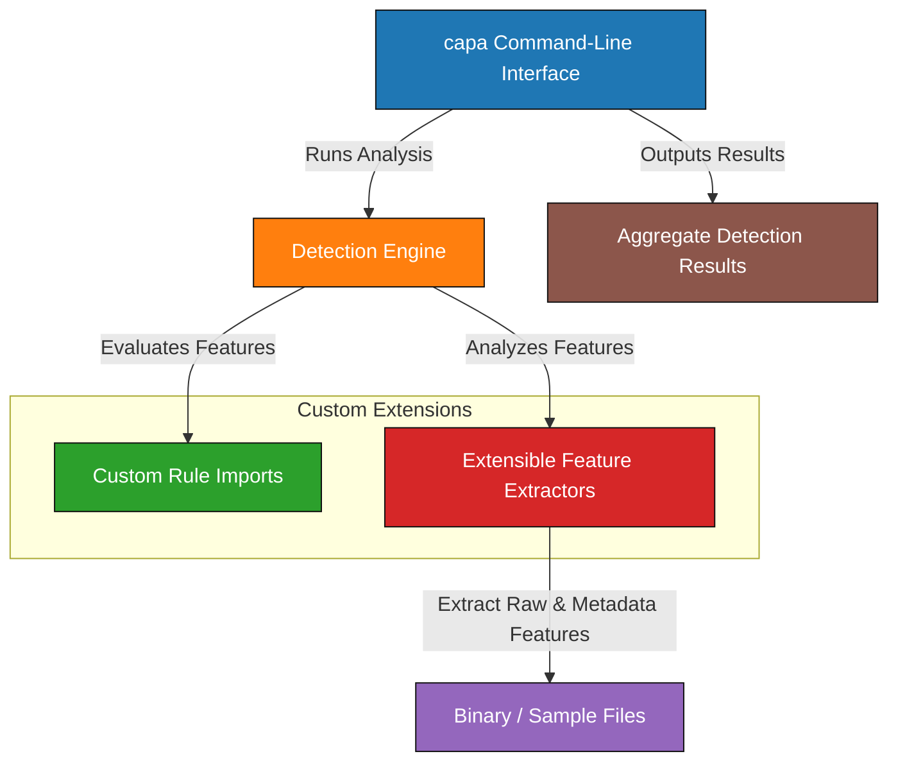

## Connecting capa with Your Workflow for Greater Impact

Integrating capa into your existing processes unlocks its full potential by seamlessly embedding powerful capability detection where it matters most. Whether you’re automating malware analysis pipelines or extending capa’s insight into specialized contexts, this page explores how capa’s integration points—the command-line interface (CLI), rule import system, and feature extractor extensibility—empower you to tailor capa’s functionality to your exact needs.

The ability to bring capa into your tools and workflows means you can automate rich behavioral insights, combine capa’s results with other analysis data, and customize detection at scale. This flexibility is critical in today’s threat landscape where speed, accuracy, and adaptability define success.

## Integration Made Practical: Who Should Leverage These Points

This page is designed for analysts, automation engineers, and advanced users who want capa to play a central role within broader toolchains or development environments. If you maintain automated malware triage systems, build custom security utilities, or develop detection frameworks, understanding how to connect capa’s components will be indispensable.

You may start by running capa from the CLI in scripted workflows, then grow into importing or extending capa’s rules and features, adapting its detection engine to your organization’s specific threats and operational models. This page clarifies how these integration options fit together and when they are most effective.

## How capa Fits Into Your Analysis Pipeline

At its core, capa is a detection engine that applies layered rules to extracted behavioral features from binaries. Its integration points let you control how you feed it inputs and retrieve outputs, as well as how you extend its understanding of those inputs through custom rules and extractors.

The CLI serves as the primary interface for running capability analyses and ingesting rule files. The rule import system enables you to bring your own YAML-based detection logic, aligning capa with your hunting hypotheses and threat models. Meanwhile, extensible feature extractors let you enhance capa’s core data collection by adding parsers or custom analysis layers—bridging gaps between raw data and detection.



This flow highlights the typical sequence when integrating capa: you feed samples and rules through the CLI, custom extractors enrich the feature set, and the engine processes these inputs to generate actionable results.

## Integration Options in Action

Imagine a malware analyst automating a triage pipeline: with capa’s CLI, they script batch processing of new samples, immediately surfacing capabilities that warrant deeper attention. To keep pace with evolving threats, they import bespoke rules tailored to emerging adversary techniques, ensuring detection logic stays current without modifying capa’s core.

In more specialized settings, a security researcher writes custom feature extractors to capture metadata unique to the binaries they investigate—such as specific compiler artifacts or undocumented API behaviors—feeding directly into capa’s engine for nuanced detection beyond the default scope.

Here’s a brief CLI example of running capa with a custom rule set:

```bash
capa --rules=./custom-rules/ --json sample.exe > results.json
```

This command loads user-supplied rules from the specified directory alongside capa’s defaults, applies them to `sample.exe`, and outputs detailed JSON-formatted detection results readily consumable by other tools.

<Tip>
Using the `--rules` option enables you to blend standard and custom logic, making capa’s capabilities uniquely aligned with your operation’s priorities.
</Tip>

By weaving capa into your automated environment in these ways, you minimize manual effort while maximizing detection depth and relevance.

## Preparing for Integration: Next Steps

Setting up these integration pathways requires some groundwork, from installing capa and understanding its CLI commands to authoring custom rules or feature extractors as needed. The [Getting Started](/getting-started/setup-and-installation/installation-instructions) section offers step-by-step guidance to get capa installed and running.

Once you’re familiar with basic execution, exploring the [Writing and Modifying capa Rules](/guides/getting-started-workflows/writing-modifying-capa-rules) guide will help you create detection logic tailored to your environment. For extending feature extraction, the [Building Custom Capabilities in capa](/guides/advanced-usage-patterns/building-custom-capabilities) section provides deeper technical instruction.

By progressively building familiarity with these components, you equip yourself to confidently embed capa’s powerful capabilities into your workflows, driving faster, smarter malware analysis.

<Source url="https://github.com/mandiant/capa" branch="main" paths={[{"path": "capa/main.py", "range": "10-80"},{"path": "docs/integration.md", "range": "1-60"}]} />
