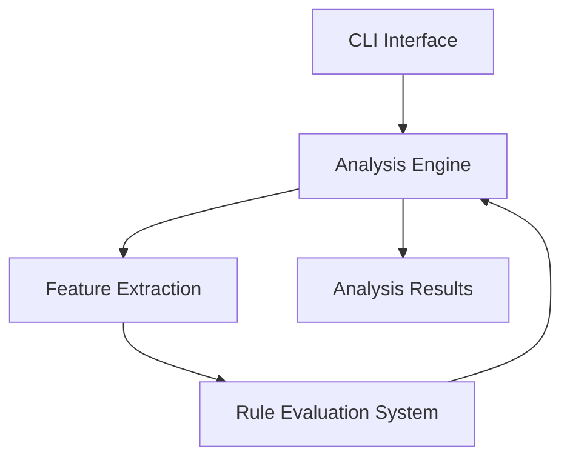

## Understanding capa's Architecture Overview

At the heart of effective binary analysis lies clarity on how each component of the system collaborates to transform raw data into actionable insights. The Architecture Overview page offers a visual and conceptual map that helps users grasp how capa orchestrates its modular components—from the initial command-line input to the generation of precise, rule-derived analysis results. This understanding empowers users to navigate capa with confidence, streamline troubleshooting, and appreciate how extensibility and rule-driven mechanisms shape its flexible workflow.

## Defining capa’s Core Structure and Its Audience

capa is a modular binary analysis tool designed to identify capabilities within executable files using a rule system that interprets features extracted from binaries. It operates by layering feature extraction, logical evaluation, and decision-making through a well-structured pipeline. This page particularly benefits analysts, reverse engineers, and security researchers who need a clear mental model of how capa processes inputs and yields results. By clarifying how each module connects, users gain the contextual insight to maximize capa’s effectiveness in varied analysis scenarios.

## Visualizing How capa Works: Key Components and Flow

At a high level, capa’s architecture consists of five primary components working in sequence: the CLI interface, the engine, the rule system, the feature extraction subsystem, and the analysis results.

The process begins when a user invokes capa via the CLI, specifying a binary for analysis. The engine then acts as the core processing unit, managing the orchestration of feature extraction and rule evaluation. Features—such as instructions, API calls, and other binary characteristics—are extracted and passed to the rule system, which applies defined logic to uncover capabilities present within the binary. Finally, the engine consolidates and formats these insights, delivering the analysis results to the user.



This straightforward flow highlights capa's modular design, promoting extensibility and clarity in how inputs translate into meaningful, rule-based insights.

## capa in Action: Applying Architecture to Real Analysis

Imagine a reverse engineer investigating a suspicious Windows executable. By running capa from the CLI, the user triggers the engine to begin processing. The feature extraction component dissects the binary into a rich set of low-level indicators: instructions sequences, imported functions, and other extracted attributes. The rule system then applies a set of human-readable rules that map these features to potential capabilities, like network communication or process injection.

For example, when feature extraction identifies calls to `CreateProcess` and network socket APIs, the rule engine correlates these with rules describing remote command and control behaviors. This connection unfolds transparently to the user, who receives a clear summary of capabilities detected.

```bash
$ capa suspicious_binary.exe
Analyzing suspicious_binary.exe...
Found capabilities:
- Process Injection
- Network Communication
```

This architecture not only clarifies execution flow but also allows users to customize or extend rules, knowing exactly where and how new logic will be integrated.

## Preparing to Explore Further: Next Steps

This Architecture Overview primes you to explore capa’s other documentation areas, such as detailed concepts about the rule system and feature sets. To get hands-on, consider progressing to the [Getting Started](/getting-started/setup-and-installation/installation-instructions) section for setup instructions or dive into the [Core Concepts & Terminology](/overview/core-concepts-and-features/capa-core-concepts) to understand the foundational language capa uses. Understanding the architecture sets a solid foundation to leverage capa’s full potential effectively.

<Source url="https://github.com/mandiant/capa" branch="main" paths={[{"path": "capa/main.py", "range": "10-60"},{"path": "capa/features/*", "range": "1-110"}]} />
