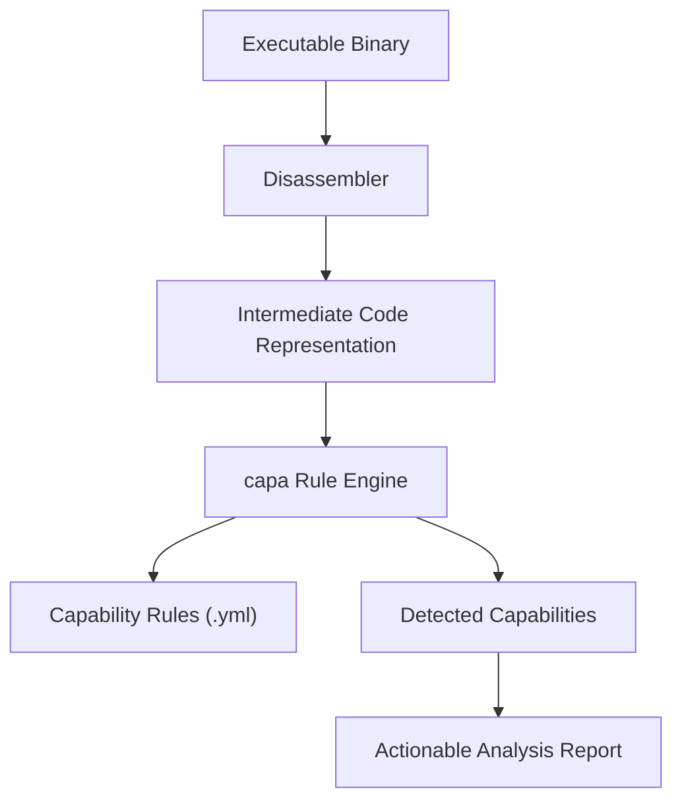

## Understanding What capa Is and Why It Matters

When you're tasked with analyzing executable binaries, quickly uncovering what these files can do is critical. Traditional manual reverse engineering is time-consuming and difficult to scale. capa offers an advanced solution by automating the detection of capabilities in executables through powerful, flexible rule matching. This streamlines malware analysis and threat hunting by distilling complex binary behaviors into clear, actionable intelligence — helping you focus on what truly matters in your investigation.

## Defining capa: Precision Detection for Binary Capabilities

capa is an open framework designed to identify what capabilities are implemented inside executable files. Using a comprehensive library of human-readable, extensible rules, capa scans binaries at the code level to match behavioral patterns indicative of specific functions or malicious techniques. It doesn’t just look at the code superficially; instead, it deeply analyzes instruction sequences to find and extract meaningful indicators of capability.

This tool is primarily aimed at malware analysts, reverse engineers, and security researchers who want to automate and standardize their workflows without sacrificing depth or accuracy. By translating complex binary artifacts into structured findings, capa empowers analysts to work faster and with greater confidence.

## How capa Works at a High Level

At its core, capa applies its curated rule sets against the executable’s disassembled code to detect predefined capabilities. These rules encode patterns such as function calls, imported APIs, and instruction sequences associated with known behaviors. When capa matches these patterns, it annotates the binary with detailed findings about the capabilities it has detected.



This straightforward pipeline highlights how capa transforms raw binaries into information analysts can act on. Users don't need to dive into raw assembly to understand the capabilities present — capa's output frames these insights clearly.

<Source url="https://github.com/mandiant/capa" branch="main" paths={[{"path": "capa/main.py", "range": "1-100"}]} />

## capa In Action: Real-World Applications

Picture investigating a suspicious Windows executable that you suspect performs credential theft. Manually sifting through assembly or assembly listings can take hours. With capa, you run the binary through the tool, and it automatically detects capabilities such as reading credential stores, network communication, or persistence mechanisms by matching its rules against the code’s behavioral patterns.

For instance, capa might identify an API call sequence related to extracting credentials from the Windows LSASS process. This immediately informs you of critical behavior without manual code tracing. Moreover, because its rules are expressed in YAML, you can customize or extend the patterns to suit specific malware families or corporate policy needs.

```bash
capa suspicious-sample.exe
```

Output summarizing capabilities found makes it easy to prioritize further investigation steps.

Analysts also use capa to scale investigations when processing large numbers of samples. Instead of manual triage, capa rapidly filters and classifies binaries based on their detected capabilities.

## Getting Started With capa

To harness capa’s power, start by ensuring you have a suitable disassembler and the necessary environment for running the tool. Installation is straightforward and covered in the [Installation Instructions](/getting-started/setup-and-installation/installation-instructions) page. After setup, running your first binary through capa will familiarize you with how its output connects binary code to meaningful behaviors.

From there, explore creating or customizing capabilities rules to match your threat landscape, guided by the detailed explanations in the [Writing and Modifying capa Rules](/guides/getting-started-workflows/writing-modifying-capa-rules) documentation.

Together, these resources prepare you to integrate capa into your analysis workflows, scaling your efficiency without sacrificing insight.